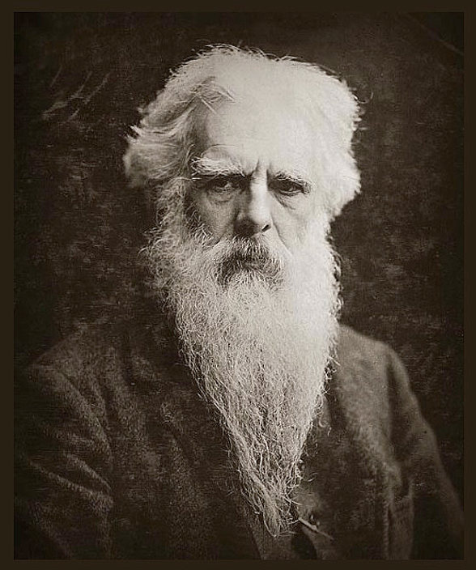

# Chronophotograpy: Picturing Time

An English photographer, Edweard Muybridge traveled the United States in the mid 1800s. He became a pioneer of American and global photography when, in 1872, Leland Stanford (former Governor of California and founder of Stanford University) hired him to take some photos of the race horse, Occident.  

Stanford had theories about how horses run, but they do it so rapidly it's hard for human beings to see. 

The question was: does a running horse ever lift _all four hooves from the ground?_ And Stanford was willing to pay to find out. There's a story that he'd bet $25,000 —almost $700,000 in today's money on the issue but whether that's true or not, he'd go on to spend twice that amount over several years of investigation.

#### _Consider:_

> What do you think? How would you go about proving it, one way or the other?

With the backing of his wealthy patron, Muybridge experimented with faster, electrically triggered, mechanical shutters (which let the light into the camera) and more sensitive photographic process to produce an image at the shorter exposure times.

 

Cameras at the time took single images, before needing to have the chemically treated plates swapped out for another go.

Muybridge arranged 12 cameras along a racetrack down which Occident would run, with threads crossing the track. 

The running animal would break each thread in succession, completing a circuit and triggering the shutter of each camera. 

In this way Muybridge was able to develop a sequence of images depicting the galloping of a horse!  

------

#### _Engage:_

> Observe the above image sequence: Can you tell whether there is a moment where all four of the horse's hooves are off the ground? 

------

Muybridge was clever enough to realize that here he had a scientific instrument unlike any developed before and [his motion studies](https://pafaarchives.org/s/digital/page/alsmain) are classics of the field!

