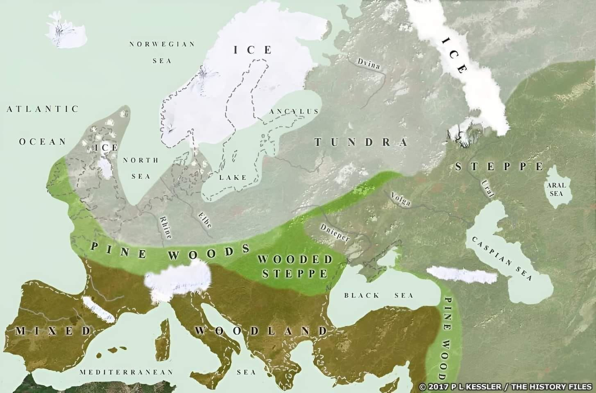
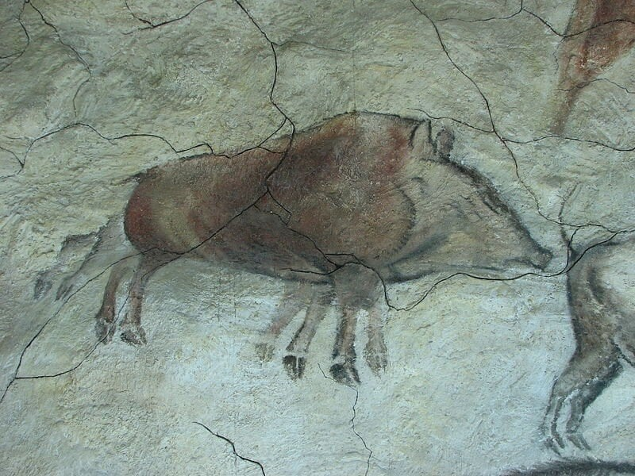
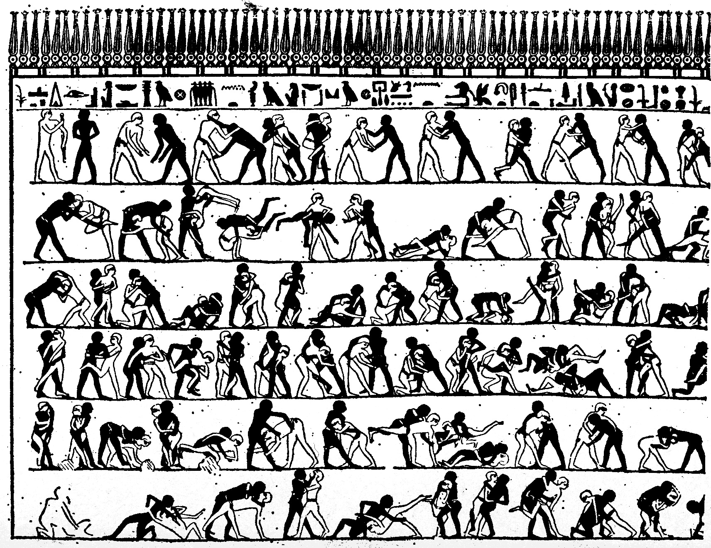

# A Timeline of Proto-Animation

## Prehistory: 

* ### Chauvet

Within a limestone plateau in the south of France are to be found the earliest known and best preserved [figurative drawings](https://www.merriam-webster.com/dictionary/figurative) in the world, dating to 32,000 years ago, when vast ice sheets covered much of Northern Europe and North America  —not yet the _peak_ of the last _Ice Age_— when Britain was connected to Europe and a land bridge joined Siberia and Alaska.

The "figures" depicted in [Chauvet Cave](https://whc.unesco.org/en/list/1426/) (be sure to click any of the footnote pictures below the main photograph for further pix!) include wooly mammoths, wooly rhinoceri (both of which would have been alive and roaming the area at the time) cave bears, horses, ibex (enormous goats with swept-back horns) reindeer, foxes, wolves, and oxen.

These images would not have been easy of access to either artists or viewers, involving longish trips through total darkness, treacherous or difficult passage to various sections. Once here, images would have been createdand viewed under the flickering, moving light of torches or small lamps burning fat.

Many images are superimposed, one atop another, as if attempting to show the motion, or some transformation of the animal. 

* ### Altamira 

A little less than 922 km (600 miles) away, in the north of Spain, the [Cave of Altamira](https://www.ancientartarchive.org/altamira-cave-spain/) contains art only perhaps a little younger than the work in Chauvet.

Among its remarkable depictions is this boar with eight legs:

Some believe this represents a kind of [timelapse image of the creature, walking](https://dn721604.ca.archive.org/0/items/eight-legged-boar-animation/eight-legged%20boar%20ANIMATION.gif)

------

#### _Consider:_

> Under a fickle light, moving through the dark, how did ancient people perceive these figures? As mobile, changing, alive with potent energy?

There must have been some special reason to create and keep such images in so remote a place. By around 21,000 years ago the original entrance to the caves had been completely sealed by rockfall, preserving it until its (re)discovery in 1994! 

------

#### _Engage:_

> [Take a (virtual) tour of Chauvet Caves!](https://www.youtube.com/watch?v=_zJbi9YatcA)

------

## Antiquity

* ### Persia (Iran)

A pottery bowl, dated to about 5,000 years ago and discovered at the archaeological site of Shahr-e Sukhteh ("Burnt City") in Iran, presents five images that have been interpreted as [consecutive phases of a goat leaping up to nip at a tree](https://mymodernmet.com/iranian-vase-animation-shahr-e-sukhteh/
).

* ### Egyptian 

Some ancientEgyptian wall art bears a striking resemblance to sequential art, such as comic books. Rows of [images of wrestlers](https://www.google.com/imgres?q=Khnumhotep%20sequential%20art%20wrestlers&imgurl=https%3A%2F%2Fi0.wp.com%2Fnijomu.com%2Fwp-content%2Fuploads%2F2024%2F12%2Fegyprianwrestlers-pre.jpg%3Ffit%3D720%252C720%26ssl%3D1&imgrefurl=https%3A%2F%2Fnijomu.com%2Fhistory%2Fbefore-comics-egyptian-wrestlers%2F&docid=nRDhTt1y28l75M&tbnid=HHE3j1Oe3ZCk8M&vet=12ahUKEwj15_yAwNeUAxU6hYkEHcIQBVwQnPAOegQIEhAB..i&w=720&h=720&hcb=2&ved=2ahUKEwj15_yAwNeUAxU6hYkEHcIQBVwQnPAOegQIEhAB#sv=CAMSXhoyKhBlLUhsN21uRUJVYWhqVGpNMg5IbDdtbkVCVWFoalRqTToORFhFM0R5R3FyY3UzSE0gBCokCg5ISEUzajFPZTNaQ2s4TRIQZS1IbDdtbkVCVWFoalRqTRgAMAEYByDD94-wC0oIEAEYASABKAE) come to mind. 

In the 1800s some visitor to the tomb of Khnumhotep II made this drawing of such a mural. One can imagine that, taken in sequence, a full wrestling match might be viewed. Though this may not have been the original intention, but rather a kind of catalogue of holds and throws… 

But in his 1993 book, _Understanding Comics_, Scott McCloud thinks he's found sequential art [almost everywhere he looks](https://archive.org/details/UnderstandingComicsTheInvisibleArtByScottMcCloud/page/n16/mode/1up), from the  Aztec codices, through the [Bayeux Tapestry](https://www.bayeuxmuseum.com/en/the-bayeux-tapestry/discover-the-bayeux-tapestry/explore-online/) and lots of _other_ places too! 

------

#### _Engage:_ 

> Explore McCloud's book on the Internet Archive to learn more about sequential art. Can you say _how_ animation is related to this art form he's describing?

------

## The "Victorian" Era

* ### Photography

A few years before Queen Victoria (for whom the era is named) ascended to the throne of Great Britain, the first photographs were made. The oldest surviving is called "View from the Window at Le Gras" and was produced by Nicéphore Niépce in 1826 or 27. Its printed on a metal plate, with an exposure time which must have been at least 8 hours and may have amounted to several days

* ### Magic Lantern

* ### Optical Toys

    * #### Thaumatrope

    * #### Zoetrope

    * #### Praxinoscope

