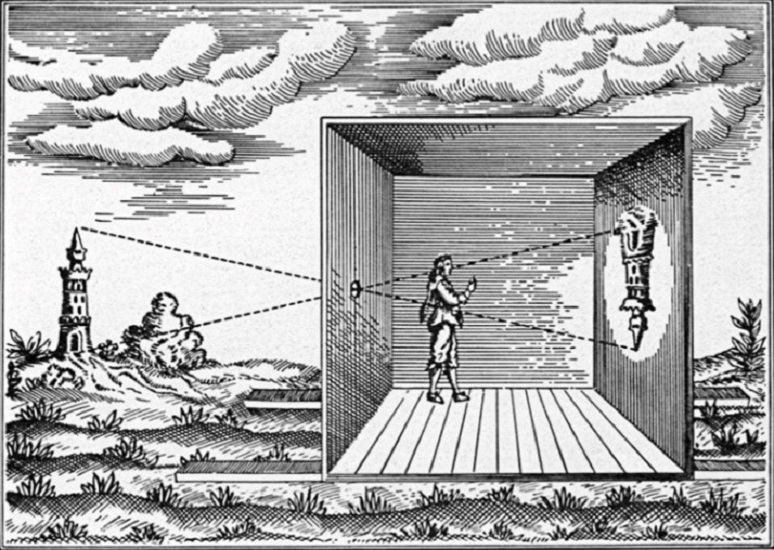

# A Timeline of Proto-Animation

## Prehistory

The species of which you are a member, has been around for at least 300,000 years —and, no doubt, has been very clever all that time. 

Early human beings did not have writing but they left behind artifacts which help us understand them.

* ### Chauvet

Within a limestone plateau in the south of France are to be found the earliest known and best preserved [figurative drawings](https://www.merriam-webster.com/dictionary/figurative) in the world, dating to 32,000 years ago, when vast ice sheets covered much of Northern Europe and North America  —not yet the _peak_ of the last _Ice Age_— when Britain was connected to Europe and a land bridge joined Siberia and Alaska.

The "figures" depicted in [Chauvet Cave](https://whc.unesco.org/en/list/1426/) (be sure to click any of the footnote pictures below the main photograph for further pix!) include wooly mammoths, wooly rhinoceri (both of which would have been alive and roaming the area at the time) cave bears, horses, ibex (enormous goats with swept-back horns) reindeer, foxes, wolves, and oxen.

These images would not have been easy of access to either artists or viewers, involving longish trips through total darkness, treacherous or difficult passage to various sections. Once here, images would have been created and viewed under the flickering, moving light of torches or small lamps burning fat.

Many images are superimposed, one atop another, as if attempting to show the motion, or some transformation of the animal. 

* ### Altamira 

A little less than 922 km (600 miles) away, in the north of Spain, the [Cave of Altamira](https://www.ancientartarchive.org/altamira-cave-spain/) contains art only perhaps a little younger than the work in Chauvet.

Among its remarkable depictions is this boar with eight legs:

Some believe this represents a kind of [timelapse image of the creature, walking](https://dn721604.ca.archive.org/0/items/eight-legged-boar-animation/eight-legged%20boar%20ANIMATION.gif)

------

#### _Consider:_

> Under a fickle light, moving through the dark, how did ancient people perceive these figures? As mobile, changing, alive with potent energy?

There must have been some special reason to create and keep such images in so remote a place. By around 21,000 years ago the original entrance to the caves had been completely sealed by rockfall, preserving it until its (re)discovery in 1994! 

------

#### _Engage:_

> [Take a (virtual) tour of Chauvet Caves!](https://www.youtube.com/watch?v=_zJbi9YatcA)

------

## Antiquity

* ### Persia (Iran)

A pottery bowl, dated to about 5,000 years ago and discovered at the archaeological site of Shahr-e Sukhteh ("Burnt City") in Iran, presents five images that have been interpreted as [consecutive phases of a goat leaping up to nip at a tree](https://mymodernmet.com/iranian-vase-animation-shahr-e-sukhteh/
).

* ### Egyptian 

Some ancientEgyptian wall art bears a striking resemblance to sequential art, such as comic books. Rows of [images of wrestlers](https://www.google.com/imgres?q=Khnumhotep%20sequential%20art%20wrestlers&imgurl=https%3A%2F%2Fi0.wp.com%2Fnijomu.com%2Fwp-content%2Fuploads%2F2024%2F12%2Fegyprianwrestlers-pre.jpg%3Ffit%3D720%252C720%26ssl%3D1&imgrefurl=https%3A%2F%2Fnijomu.com%2Fhistory%2Fbefore-comics-egyptian-wrestlers%2F&docid=nRDhTt1y28l75M&tbnid=HHE3j1Oe3ZCk8M&vet=12ahUKEwj15_yAwNeUAxU6hYkEHcIQBVwQnPAOegQIEhAB..i&w=720&h=720&hcb=2&ved=2ahUKEwj15_yAwNeUAxU6hYkEHcIQBVwQnPAOegQIEhAB#sv=CAMSXhoyKhBlLUhsN21uRUJVYWhqVGpNMg5IbDdtbkVCVWFoalRqTToORFhFM0R5R3FyY3UzSE0gBCokCg5ISEUzajFPZTNaQ2s4TRIQZS1IbDdtbkVCVWFoalRqTRgAMAEYByDD94-wC0oIEAEYASABKAE) come to mind. 

In the 1800s some visitor to the tomb of Khnumhotep II made this drawing of such a mural. One can imagine that, taken in sequence, a full wrestling match might be viewed. Though this may not have been the original intention, but rather a kind of catalogue of holds and throws… 

But in his 1993 book, _Understanding Comics_, Scott McCloud thinks he's found sequential art [almost everywhere he looks](https://archive.org/details/UnderstandingComicsTheInvisibleArtByScottMcCloud/page/n16/mode/1up), from the  Aztec codices, through the [Bayeux Tapestry](https://www.bayeuxmuseum.com/en/the-bayeux-tapestry/discover-the-bayeux-tapestry/explore-online/) and lots of _other_ places too! 

------

#### _Engage:_ 

> Explore McCloud's book on the Internet Archive to learn more about sequential art. Can you say _how_ animation is related to this art form he's describing?

------

## Classical Antiquity

It may surprise you that our word "camera" comes from the latin word for a "room". Like the room in a house, or a hotel.
Thus a  and it has been known for at least two and a half millennia that, if light shines through a "pin hole" or small aperture into a darkened space, those within can see an inverted image of what lies outside.

You may have heard this described as a "pinhole camera" and the Greek philospher Aristotle (384-322 BCE) was said to have used [such an apparatus to safely observe solar eclipses](https://www.youtube.com/watch?v=pqh5GDPqZRk). 

------

## The Scientific Revolution

With the invention of the telescope and the microscope early in the 17th century, the production of optical lenses became an important industry. 

Some time in that century, the "Magic Lantern" was invented, perhaps by [someone like Christiaan Huygens](https://www.luikerwaal.com/newframe_uk.htm?/huygens_uk.htm) or Athanasius Kircher, whose  book, _Ars Magna Lucis et Umbrae_ ("The Great Art of Light and Shadow") contains [an illustration of just such a device](https://en.wikipedia.org/wiki/Ars_Magna_Lucis_et_Umbrae#/media/File:Illustration_of_a_magic_lantern_from_%E2%80%9CArs_Magna_Lucis_et_Umbrae%E2%80%9D.jpg). 

The magic lantern was popular in entertainment and became an educational tool. It consisted of a curved, "concave" mirror directing a light source through a sheet of painted glass —a "lantern slide" and a focusing lense.
<iframe
  class="video-left"
  src="https://www.youtube.com/embed/Xicaw_vhSKw?si=ta13QoACgL8WHSUp"
  title="YouTube video player"
  frameborder="0"
  allow="autoplay; web-share"
  referrerpolicy="strict-origin-when-cross-origin"
  allowfullscreen>
</iframe>
Whatever's painted on the glass will appear, projected —as with the camera obscura— _upside down_ (the slides were inverted to correct this effect).
Slides could be changed, moved or filtered or crossfaded. The path of the image could be altered with mirrors or by moving the projector and some startling theatrical effects were thereby produced to delight or terrify audiences.

------

## The "Victorian" Era

### Photography

A few years before Queen Victoria (for whom the era is named) ascended to the throne of Great Britain, the first photographs were made. The oldest surviving is called _View from the Window at Le Gras_ and was produced by Nicéphore Niépce in 1826 or 27. It's printed on a metal plate, with an exposure time which must have been at least 8 hours and may have amounted to several days.

Of course no one was going to sit still for that! If photography was to become a form of portraiture, it would have to pick up the pace.

The first photograph to show a living person did so by accident and was produced in 1838 by Louis-Jacques-Mandé Daguerre,who would give his name to the daguerreotype which could produce a highly detailed, one-of-a-kind image directly onto a polished, silver-coated copper plate using toxic mercury vapor. It was a commercial success!

------

#### _Consider:_

> Below is the "human figure" from the Daguerre image. Can you guess what he's doing? The exposure time on this was at least 10 minutes and there must've been people, moving carts, etc on the street which the camer was not quick enough to capture. See of you can learn what people thinking this guy was up to? It may help to know the photograph is known as _Boulevard du Temple_    

------

### Optical Toys

Around this time some interestingly named "optical toys", gismos and curiosities became popular:

* #### Thaumatrope, Zoetrope, Praxinoscope

<iframe
  class="video-left"
  src="https://www.youtube.com/embed/U32Sv99cDOs?si=_zgAN30SCj5mEA1L"
  title="YouTube video player"
  frameborder="0"
  allow="autoplay; web-share"
  referrerpolicy="strict-origin-when-cross-origin"
  allowfullscreen>
</iframe>

<iframe
  class="video-left"
  src="https://www.youtube.com/embed/-3yarT_h2ws?si=m3yLkPIE4i3LywDc"
  title="YouTube video player"
  frameborder="0"
  allow="autoplay; web-share"
  referrerpolicy="strict-origin-when-cross-origin"
  allowfullscreen>
</iframe>

<iframe
  class="video-left"
  src="https://www.youtube.com/embed/eJqp7Dlq66k?si=JmvOS4-DvglL-soR"
  title="YouTube video player"
  frameborder="0"
  allow="autoplay; web-share"
  referrerpolicy="strict-origin-when-cross-origin"
  allowfullscreen>
</iframe>

#### _Consider:_

> It's important to notice in the the last two examples that the images have to be separated. We need to see each image and then the next _in the same place_ as the first. Otherwise they all become a blur. Can you tell how projected cinematic film separates the individual frames of the image for our eye?

------
------

